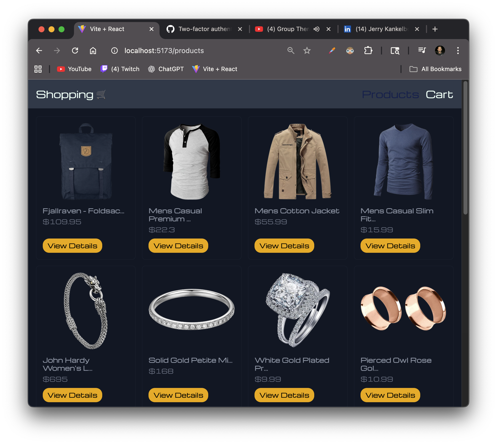
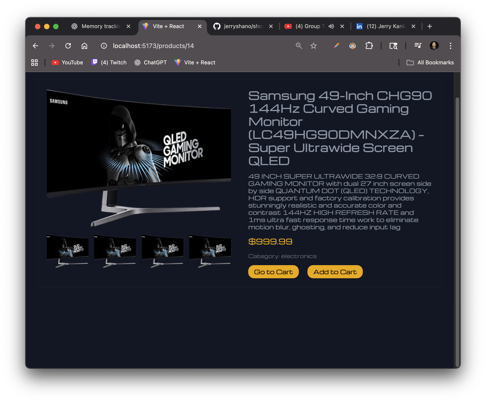
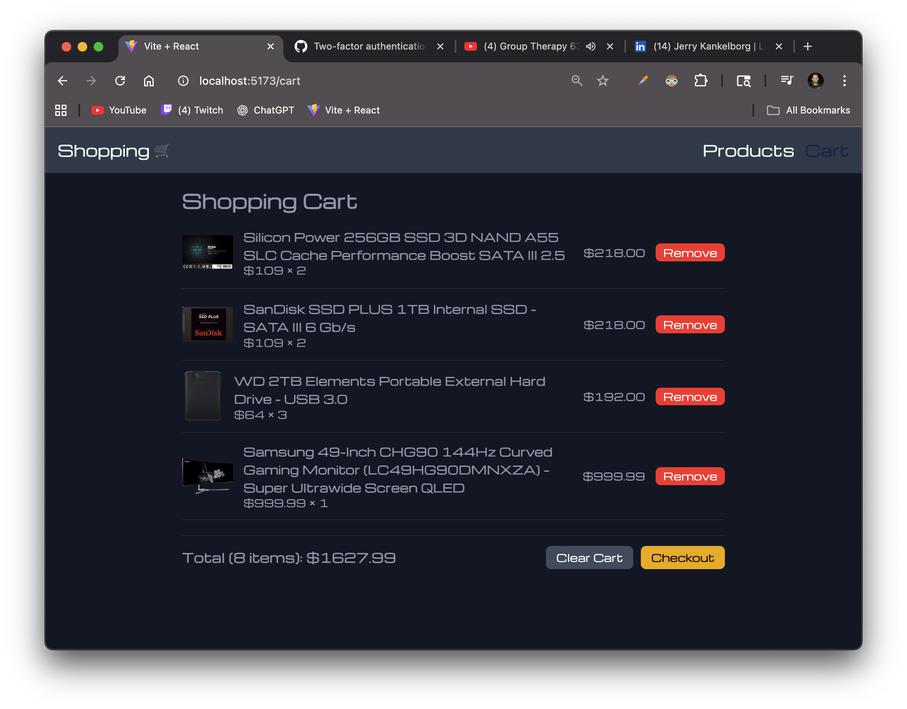

# 🛒 Shopping Cart App


A modern shopping cart built with **React, Redux Toolkit, Tailwind CSS**, and **Vite**.  
This app demonstrates fetching products from an API, browsing product details, and managing a cart with global state.

---

## 🚀 Features

- **Product Listing** – Browse items fetched from [Fake Store API](https://fakestoreapi.com/)
- **Product Details Page** – View product images, description, price, and category
- **Add to Cart** – Increment items, track total quantity and total price
- **Cart Page** – Review items, remove items, or clear the cart entirely
- **Responsive UI** – Clean, mobile-friendly layout using Tailwind CSS
- **Redux Toolkit** – Centralized state management for products & cart

---

## 🖼️ Screenshots





---

## ⚙️ Tech Stack

- **React 18**
- **Redux Toolkit** (state management)
- **Axios** (API requests)
- **Tailwind CSS** (styling)
- **Vite** (development & build tool)

---

## 📦 Installation & Setup

Clone the repo:
```bash
git clone https://github.com/jerryshano/shopping-cart.git
cd shopping-cart
